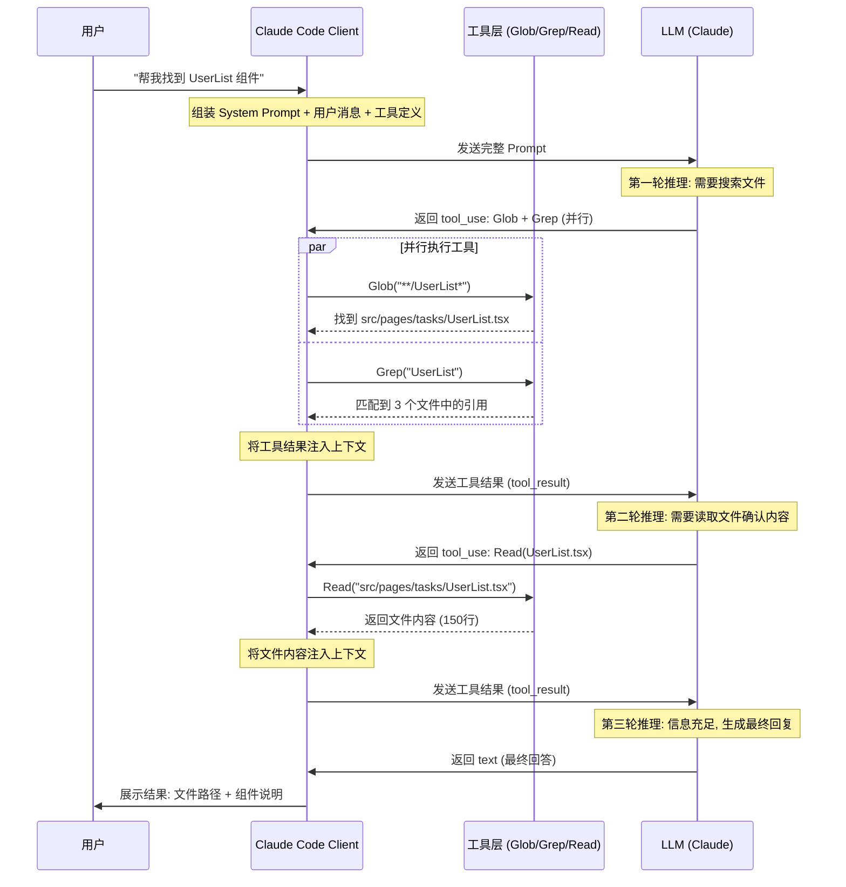

# 前端 Vibe Coding 实践

# 一、前置准备

## 1.1 安装 Claude Code

> Claude Code（简称 CC）是 Anthropic 发布于 2025 年 2 月的终端编程 Agent，具备自主计划、自主行动、追求目标达成的能力。

官方文档：[https://docs.claude.com/en/docs/claude-code/overview](https://docs.claude.com/en/docs/claude-code/overview)

```bash
# 安装
npm install -g @anthropic-ai/claude-code

# 验证
claude --version
```

## 1.2 初始化前端工程

```bash
# 使用 Vite 脚手架命令创建
pnpm create vite

# 选择 React 框架
Select a framework:  React
Select a variant:  TypeScript + React Compiler

# 安装依赖 & 启动服务
Install with pnpm and start now?  ● Yes / ○ No
```

# 二、Claude Code 的基础使用

## 2.1 CC 与 LLM Loop

Claude Code 的 Harness 工程相对其他编程 Agent 有明显优势——区别于一问一答的对话式 AI，CC 是一个完全自主的 Agent，具备**自主计划、自主行动、追求目标达成**的能力。这个整体过程被称为 LLM Loop（大模型循环）。

以下是一个简要示例：



## 2.2 CC 常用命令

**启动 Claude Code：**

在终端内指定目录下输入 `claude` 后回车即可进入命令行工具界面。

**常用命令速查表：**

| 命令 | 说明 |
| - | - |
| `Shift + Tab` | 切换模式。内置三种模式：默认模式、自动编辑模式、计划模式。默认情况下不需要手动切换，CC 会根据任务复杂程度自动选择。注意：自动编辑模式下只会自动编辑代码，遇到需要执行终端命令时仍会询问用户同意。 |
| `claude --dangerously-skip-permissions` | 绕过权限控制，直接执行任意命令不需要用户同意 |
| `/` | 列出全部指令集，支持字母模糊匹配搜索 |
| `@` | 引用文件，支持字母模糊匹配搜索 |
| `/skills` | 列出当前所有已安装的技能 |
| `/plugin` | 管理已安装插件 |
| `/compact` | 压缩上下文（当对话过长时使用） |
| `/context` | 查看当前会话的上下文信息 |
| `/statusline` | 创建自动展示上下文信息的状态栏（如模型名称、上下文进度条等） |
| `/model` | 切换使用的模型 |
| `/clear` | 清空当前上下文 |
| `/resume` | 查看历史会话 |
| `/rewind` | 在当前会话中回退会话轮次 |
| `!` | 进入 Bash Mode，可直接执行 Shell 命令 |
| `/exit` | 退出 Claude Code |
| `claude -c` | 继续上次的会话（默认执行 `claude` 会打开新会话） |

# 三、前端工程 Skills

## 3.1 Ant Design 组件 Skill

通用安装规范：使用 `npx skills add ${github_repo}/skills` 安装 GitHub 上的开源 Skill。

如安装 antd 官方 Skill：

```bash
npx skills add ant-design/ant-design-cli
```

## 3.2 工程初始化 Skill

```bash
npx skills add consistent-k/my-skills
```

**说明：** 初始化前端工程结构、配置前端完整工具链，如 ESLint、Prettier、Husky、Git Hooks 等。

Skill 的安装位置推荐放在 `~/.claude/skills` 目录内，CC 启动时会自动识别该目录下的 Skill。

在 Claude Code 里调用对应的 Skill（如 `/init-react-frontend`），可以选择完整工具链或最小工具链。执行命令时会征求用户同意，最终效果：CC 会根据 Skill 完成目录结构、工具链等全套配置。

# 四、新建规则文件（Rules）

规则文件是给 Agent 提供的项目级约定，常见存放位置：

- **全局**：`~/.claude/rules/`（或各工具指定的全局规则目录）
- **项目级**：`/project/.claude/rules/`

常见的规则文件分类：

| 文件 | 用途 |
| - | - |
| [代码风格规范](./rules/code-style.md) | ESLint、Prettier 和 Git 提交规范 |
| [卡片列表页面规范](./rules/card-list-page-conventions.md) | 卡片列表页面开发约定 |
| [表单页面规范](./rules/form-page-conventions.md) | 新建/编辑表单页面开发约定 |
| [表格页面规范](./rules/table-page-conventions.md) | 表格页面开发约定 |
| [样式规范](./rules/styling-conventions.md) | 样式开发约定 |

# 五、CLAUDE.md

CLAUDE.md 是 CC 的配置文件，支持 **全局级**（`~/.claude/CLAUDE.md`）、**项目级**（`/project/CLAUDE.md`）、**文件夹级**（`/project/src/CLAUDE.md`）三种配置。

作用：Agent 每次启动时会自动读取此文件，确保生成的代码符合项目约定，减少人工校正成本。

注意：建议项目有一定的雏形再新建，不要在空项目里新建。

它可以为 Agent 提供项目上下文，包括：

- **常用命令**：dev、build、lint、commit 等
- **项目架构**：技术栈、目录结构、路由规则、请求层约定
- **样式规范**：CSS-in-JS 写法、主题配置、组件命名

生成 CLAUDE.md 只需要在 CC 内输入 `/init` 后回车，CC 会自动创建，后续可以按需调整。

前端工程里除了 **常用命令、项目架构、样式规范** 等基础配置外，还可以自定义以下配置：

- **工作流规则**：每次修改后必须执行 lint:fix + format
- **Commit 规范**：格式、scope、Co-Authored-By 等

```markdown
## Workflow Rules

- **每次完成代码修改后，必须依次执行 `pnpm lint:fix` 和 `pnpm format`**，确保代码质量和风格一致。

## Commit Style

格式：`type: subject` → 空行 → bullet 列表 → 空行 → Co-Authored-By

- bullet 格式：`- scope：description`，scope 为文件/模块名
- 每行不超过 100 字符（commitlint 强制）
- 详见 CLAUDE.md §Commit Style
```

推荐开源库：[https://github.com/forrestchang/andrej-karpathy-skills](https://github.com/forrestchang/andrej-karpathy-skills) 一个靠 60 行左右的 CLAUDE.md 获得了 110K Star 的神级项目。

# 六、产品需求文档交付 AI

**适用场景**：无 UI 的纯逻辑开发，或完全不需要 UI 的需求。有 UI 设计稿的需求请直接看 **第七章：使用 Figma2Code 能力**。

## 6.1 导出需求文档为 Markdown

将产品需求文档（PRD）从知识库工具导出为 Markdown 格式，便于 Agent 读取。

## 6.2 在前端代码库内新建 mrd.md

将导出的 Markdown 文档放到项目根目录，命名为 `mrd.md`（或任意语义化命名）。

## 6.3 使用 Agent 读取 mrd.md 生成代码

使用 `@` 引用文件和规范，让 Agent 基于需求文档生成初版代码（无 UI 美化效果）。

## 6.4 经验总结

1. 需求文档需尽可能完整、准确，避免出现遗漏、描述缺失或边界不清的问题。
2. 当前产品通过 Figma Make 模式提供的交互稿，与需求文档之间存在差异。在缺乏统一标准和对应规范的情况下，对前端工程化开发的帮助不大。
3. 本章节更适用于无 UI 场景的逻辑开发，或对界面设计没有要求的需求。
4. 在 UI 设计与研发并行推进的情况下，若过早使用 AI 生成初始代码，容易与后续正式设计稿产生偏差，最终带来较高的返工成本。

# 七、使用 Figma2Code 能力

**适用场景**：有 UI 设计稿的需求，直接从 Figma 稿件生成前端代码。

## 7.1 选择合适的 Figma2Code 工具

市面上已有多种 Figma → Code 的能力（Figma Dev Mode、第三方插件等），可以将设计稿转成 React/HTML/CSS 代码，或者发送到 Agent 进行二次加工。

## 7.2 将 Figma 稿件交给 Agent

通过工具导出设计稿信息（结构、样式、切图）后，让 Agent 基于项目内的组件库进行二次改造，生成符合项目规范的代码。

## 7.3 Figma2Code 的局限性

Figma2Code 在提升前端开发效率方面确实有价值，尤其适合快速原型、静态页面生成和中后台基础界面搭建，但在真实业务场景中仍然存在较明显的局限性。

首先，生成结果往往更偏向 **"视觉还原"**，而不是 **"工程化实现"**。AI 可以较好地复刻页面结构与样式，但对于 **组件抽象、状态管理、交互逻辑、权限控制、数据流设计** 等真实业务能力仍缺乏理解，生成代码通常需要研发进行大量二次重构。

其次，设计稿与代码之间天然存在语义鸿沟。Figma 中大量内容本质上只是视觉元素，而不是具备明确语义的业务组件。AI 很难准确识别哪些区域应该沉淀为可复用组件、哪些应该接入 Design Token、哪些属于业务容器层，导致生成代码容易出现组件碎片化、层级冗余、可维护性差的问题。

另外，目前大部分 Figma2Code 工具对复杂设计体系支持有限。当项目存在 Design System、多主题、响应式布局、动态交互、条件渲染、国际化等场景时，生成效果会明显下降，很难直接适配企业级研发规范。

在团队协作层面，也存在设计与研发标准不统一的问题。如果 Figma 文件本身缺少规范化命名、Auto Layout 使用不一致、组件约束不完整，那么 AI 生成结果会进一步失真，甚至出现不可维护代码。

最后，Figma2Code 更适合作为"辅助开发工具"，而不是"替代前端开发"。当前阶段它更像是提升 UI 搭建效率、降低重复劳动的能力增强工具，但距离真正实现高质量、可维护、可扩展的生产级代码自动生成，还有较大差距。

# 八、接口 Service 层定义

前端代码里的 Service 层（API 层）专门维护前后端的 API 请求交互，不涉及 UI 层。

规范的后端 API 文档对 AI 生成 Service 层有极大帮助。

## 8.1 导出接口文档

推荐使用规范化的接口文档管理工具（如 Apifox、Swagger/OpenAPI、YApi 等）维护后端接口文档，并导出为 JSON/YAML 格式。

## 8.2 导出的文件存放到代码库内

将导出的接口文档放到代码库的约定目录下（如 `docs/api/` 或 `mock/api/`），便于 Agent 直接读取。

## 8.3 使用 Claude Code 完成接口 Service 层定义

引用 JSON 文件后输入 prompt：

> 按照接口文档完成 service 层定义和页面请求逻辑补充、完成 mock 数据

Agent 会根据接口文档自动生成类型定义、请求函数和 mock 数据。

# 九、CC 的插件系统和记忆系统

插件系统（Skills / MCP / Hooks）、记忆系统（Memory / Context Persistence）——这两套东西本质上决定了 Claude Code 能不能从"聊天工具"变成真正长期可用的 AI 开发环境。

## 9.1 插件系统

使用 `/plugin` 开启，官方内置了插件市场，推荐必装插件 **superpowers**，它提供可组合的技能，包括系统化调试、头脑风暴、内置代码审查的子 Agent，以及创建新 Skill 的能力。

如果没有使用过 Skill 或者 Plugin，可以使用以下命令作为入门：`/simplify`

`simplify` 是 Claude Code 内置的代码优化命令，主要用于在功能开发完成后，对最近修改的代码进行自动整理与简化。

**流程如下：**

1. 先看你的 git diff
2. 找最近修改的文件
3. 启动 3 个 review agent 并行分析（Code Reuse（查重复代码）、Code Quality（查可读性/结构）、Efficiency（查性能/浪费计算））
4. 汇总结果
5. 自动修改代码

## 9.2 记忆系统

使用 `/memory` 查看。

| 类型 | 位置 | 作用 |
| - | - | - |
| 项目记忆 | `./CLAUDE.md` | 给当前项目使用 |
| 用户记忆 | `~/.claude/CLAUDE.md` | 给用户个人使用，可以存放个人习惯等 |
| 自动记忆 | `~/.claude/projects/xxxx/memory` | 自动记忆系统，可以存放一些用户主动让 CC 记住的 |

## 9.3 插件系统和记忆系统结合实践

背景：团队提交代码需要绑定某个任务编号，所以 commit 信息里必须包含任务编号。

先在插件系统内安装 `commit-commands` 插件，再使用 Prompt 触发 CC 的主动记忆系统：

> 请你记住，在我们每次使用 commit 技能的时候，你要先向我询问本次要绑定的任务编号再执行 commit，你可以先看下我之前的 commit 是怎么写的任务编号。

之后调用 commit 技能的时候，CC 会主动询问任务编号，并按照 CLAUDE.md 里的提交规范进行编写 commit 信息。

# 十、总结

## 10.1 Vibe Coding 工作流全景

```
设计稿/需求文档 → Agent 生成初版代码 → 人工审查 & 迭代 → lint + format → commit
```

| 输入物 | 推荐方式 | 对应章节 |
| - | - | - |
| Figma 设计稿 | Figma2Code → 二次改造 | 第七章 |
| 产品需求文档（无 UI） | 导出 Markdown → Agent 生成 | 第六章 |
| 后端 API 文档 | 接口文档导出 JSON → Agent 生成 Service 层 | 第八章 |

## 10.2 关键经验

1. **规则先行**：在动手写代码前，先配好 CLAUDE.md + Rules 文件。规则越明确，Agent 产出质量越高，返工越少。
2. **输入决定输出**：需求文档/设计稿/API 文档的完整度直接决定生成代码的可用率。垃圾进，垃圾出。
3. **分层使用**：
    - UI 层：优先用 Figma2Code，再用组件库二次改造
    - 逻辑层：用需求文档驱动 Agent 生成
    - Service 层：用 API 文档驱动，生成类型定义 + 请求函数 + Mock 数据
4. **人机协作而非替代**：Agent 擅长重复性搭建工作（页面骨架、Service 定义、工具链配置），但业务逻辑、交互细节、异常处理仍需研发把控。
5. **小步迭代**：每次给 Agent 的任务粒度不宜过大，拆成单页面/单模块粒度效果最佳。

## 10.3 适用边界

| 适合 AI 生成 | 仍需人工主导 |
| - | - |
| 工程初始化 & 工具链配置 | 复杂业务逻辑 & 状态管理 |
| CRUD 页面骨架 | 性能优化 & 边界处理 |
| Service 层 & 类型定义 | 权限控制 & 安全相关 |
| 表格/表单/列表等标准页面 | 跨模块联动 & 架构决策 |
| Mock 数据 & 单元测试骨架 | 设计还原的像素级调整 |

## 10.4 当前局限性

1. **上下文窗口有限**：Agent 单次会话的上下文存在上限，超大文件或跨多模块的全局重构容易丢失关键信息，导致生成代码前后不一致。需要合理使用 `/compact` 压缩上下文，或拆分任务粒度。
2. **缺乏运行时反馈**：Agent 无法实际运行页面、查看渲染结果或调试浏览器。它不知道生成的 UI 是否对齐设计稿、交互是否符合预期，这些仍依赖人工验证。
3. **业务语义理解薄弱**：对于领域特有的业务概念，Agent 只能依赖你在 prompt 文档中提供的描述，无法自主理解业务上下文。
4. **存量代码改造风险高**：对已有大量业务逻辑的模块进行重构时，Agent 可能忽略隐式依赖、副作用或历史兼容逻辑，改动后引入回归 bug。
5. **样式还原精度不足**：Agent 生成的 CSS 往往只能做到"大致对"，间距、字号、颜色等细节与设计稿的像素级对齐仍需人工微调。
6. **模型幻觉**：Agent 可能编造不存在的 API、组件属性或配置项。对于不确定的生成内容，务必交叉验证官方文档。
7. **理解力负债**：指过度依赖 AI 和自动化对人类智能和记忆造成的隐性成本。推荐阅读文章：[https://addyosmani.com/blog/comprehension-debt/](https://addyosmani.com/blog/comprehension-debt/)

## 10.5 推荐实践顺序

对于一个全新需求的推荐开发顺序：

1. 配置 CLAUDE.md + Rules（一次性）
2. 用工程 Skill 初始化项目结构（一次性）
3. 导出接口文档 → Agent 生成 Service 层
4. 拿到设计稿后用 Figma2Code 生成页面骨架
5. 引导 Agent 结合组件库二次改造
6. 人工补充业务逻辑、交互细节、异常处理
7. lint:fix + format → commit
