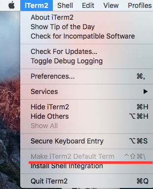
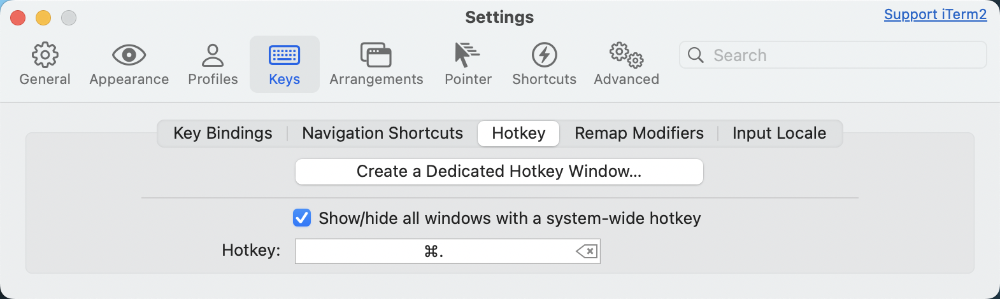

# iTem2


## 安装
```bash
# 官网下载
https://iterm2.com/
```

## 美化改造

### 配置

将iTem2设置为默认终端：（菜单栏）iTerm2 -> Make iTerm2 Default Term



然后打开偏好设置preference，选中Keys，勾选Hotkey下的Show/hide iTerm2 with a system-wide hotkey，将热键设置为command+. ，这样你就可以通过command+. 全局热键来打开或关闭iTerm2窗口，非常方便。




### 安装oh-my-zsh

github连接：https://github.com/robbyrussell/oh-my-zsh

使用 crul 安装：

```bash
sh -c "$(curl -fsSL https://raw.github.com/robbyrussell/oh-my-zsh/master/tools/install.sh)"
```

或使用wget：


```bash
sh -c "$(wget https://raw.githubusercontent.com/robbyrussell/oh-my-zsh/master/tools/install.sh -O -)"
```


### 主题

安装成功后，用vim打开隐藏文件 .zshrc ，修改主题为 agnoster：

```bash
ZSH_THEME="agnoster"
```

应用这个主题需要特殊的字体支持，否则会出现乱码情况，这时我们来配置字体：

1.使用 [Meslo](https://github.com/powerline/fonts/blob/master/Meslo%20Slashed/Meslo%20LG%20M%20Regular%20for%20Powerline.ttf) 字体，点开连接点击 view raw 下载字体。

2.安装字体到系统字体册。

3.应用字体到iTerm2下，我自己喜欢将字号设置为14px，看着舒服（iTerm -> Preferences -> Profiles -> Text -> Change Font）。

4.重新打开iTerm2窗口，这时便可以看到效果了。


### 自动提示命令

当我们输入命令时，终端会自动提示你接下来可能要输入的命令，这时按 → 便可输出这些命令，非常方便。

设置如下：

1.克隆仓库到本地 ~/.oh-my-zsh/custom/plugins 路径下

```bash
git clone git://github.com/zsh-users/zsh-autosuggestions $ZSH_CUSTOM/plugins/zsh-autosuggestions
```

2.用 vim 打开 .zshrc 文件，找到插件设置命令，默认是 plugins=(git) ，我们把它修改为

```bash
plugins=(zsh-autosuggestions git)
```


3.重新打开终端窗口。

PS：当你重新打开终端的时候可能看不到变化，可能你的字体颜色太淡了，我们把其改亮一些：

移动到 ~/.oh-my-zsh/custom/plugins/zsh-autosuggestions 路径下

```bash
cd ~/.oh-my-zsh/custom/plugins/zsh-autosuggestions
```

用 vim 打开 zsh-autosuggestions.zsh 文件，修改 ZSH_AUTOSUGGEST_HIGHLIGHT_STYLE='fg=10'


### 语法高亮

1.使用homebrew安装 zsh-syntax-highlighting 插件。

```bash
brew install zsh-syntax-highlighting
```

2.配置.zshrc文件，插入一行。

```bash
source /opt/homebrew/share/zsh-syntax-highlighting/zsh-syntax-highlighting.zsh
```

3.输入命令。

```bash
source ~/.zshrc
```